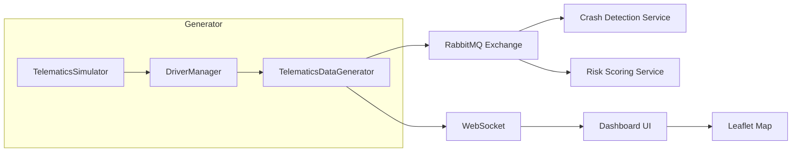

# IMC Telematics Generator


Real-time vehicle telematics simulation for insurance risk analysis and crash detection.

## About

Insurance companies need realistic telematics data to develop and test crash detection algorithms, risk scoring models, and claims processing systems. IMC Telematics Generator simulates 25 drivers traveling around the Atlanta metro area, producing high-fidelity sensor data including GPS coordinates, accelerometer readings, and gyroscope measurements.

The simulator models real-world driving patterns with aggressive vs. conservative drivers, time-of-day behavior changes, and 9 distinct accident types—each with characteristic sensor signatures that match actual crash telemetry.

## Key Features

- **Multi-Driver Simulation** — 25 unique drivers with realistic profiles, vehicles, and daily routes
- **Crash Detection Testing** — 9 accident types with physics-based sensor signatures
- **Real-Time Dashboard** — Interactive map with live driver positions and crash notifications
- **Behavior Modeling** — Aggressive vs. normal drivers with different speeding/braking patterns
- **Time-Aware Patterns** — Rush hour boosts, nighttime reduction, random traffic stops
- **RabbitMQ Integration** — Publishes to fanout exchange for downstream consumers
- **Cloud-Ready** — Deploys to Cloud Foundry with service binding

## Built With

- [Spring Boot 3.5.4](https://spring.io/projects/spring-boot) — Application framework
- [Spring Cloud Stream](https://spring.io/projects/spring-cloud-stream) — RabbitMQ messaging
- [Spring WebSocket](https://docs.spring.io/spring-framework/reference/web/websocket.html) — Real-time updates
- [Leaflet.js](https://leafletjs.com/) — Interactive mapping
- [Thymeleaf](https://www.thymeleaf.org/) — Server-side templates

## Architecture



## Getting Started

### Prerequisites

- Java 21+ ([download](https://adoptium.net/))
- Maven 3.8+ ([download](https://maven.apache.org/download.cgi))
- RabbitMQ 3.x ([install](https://www.rabbitmq.com/download.html)) or Docker

### Installation

1. Clone the repository
   ```bash
   git clone https://github.com/insurance-megacorp/imc-telematics-gen.git
   cd imc-telematics-gen
   ```

2. Build the application
   ```bash
   ./mvnw clean package
   ```

3. Start RabbitMQ (if using Docker)
   ```bash
   docker run -d --name rabbitmq -p 5672:5672 -p 15672:15672 rabbitmq:3-management
   ```

4. Run the application
   ```bash
   java -jar target/telematicsgen-4.1.4.jar
   ```

5. Open the dashboard at http://localhost:8082

## Usage

### Dashboard Controls

The web dashboard provides real-time visualization and control:

- **Trigger Accident** — Manually trigger crash for a specific or random driver
- **Random Accidents** — Toggle automatic random crash events
- **Start All Driving** — Get all parked drivers moving
- **Stop/Resume** — Pause or resume telemetry generation
- **Message Rate** — Adjust telemetry frequency (10-100ms)

### REST API

| Method | Endpoint | Description |
|--------|----------|-------------|
| GET | `/api/drivers` | Get all driver positions and states |
| POST | `/api/drivers/start-all` | Start all parked drivers |
| POST | `/api/pause` | Pause telemetry generation |
| POST | `/api/resume` | Resume telemetry generation |
| POST | `/api/interval?ms={value}` | Set message interval |

### WebSocket Topics

Subscribe via STOMP for real-time updates:

| Topic | Description |
|-------|-------------|
| `/topic/drivers` | Driver location updates |
| `/topic/drivers/accident` | Crash notifications with details |

## Environment Variables

| Variable | Description | Default |
|----------|-------------|---------|
| `SIMULATION_INTERVAL_MS` | Milliseconds between messages | `500` |
| `DRIVER_COUNT` | Number of active drivers (max 25) | `3` |
| `CRASH_FREQUENCY` | Messages between random crashes | `50` |
| `POST_CRASH_IDLE_MINUTES` | Driver idle time after crash | `10` |
| `RANDOM_STOP_PROBABILITY` | Chance of random traffic stop | `0.05` |
| `TELEMATICS_EXCHANGE_NAME` | RabbitMQ exchange name | `telematics_exchange` |

## Accident Types

Each accident type produces characteristic sensor signatures:

| Type | Probability | Signature |
|------|-------------|-----------|
| Rear-End Collision | 35% | Strong deceleration (-X accel) |
| Side Swipe | 20% | Moderate lateral (Y accel) |
| T-Bone | 18% | High lateral force, roll |
| Single Vehicle | 15% | Strong frontal impact |
| Hit and Run | 6% | Variable impact angles |
| Multi-Vehicle Pileup | 3% | Multiple impact signatures |
| Head-On | 2% | Extreme deceleration |
| Rollover | 1% | Chaotic all axes |

## Driver Behavior

### Driver Types

| Type | Count | Speeding | Hard Braking | Rapid Acceleration |
|------|-------|----------|--------------|-------------------|
| Aggressive | 7 | 20% (15-25 over) | 5% | 5% |
| Normal | 18 | 10% (15-25 over) | 2% | 2% |

### Time-Based Patterns

- **Night (8 PM - 6 AM)** — 70% driving reduction, 85% parked
- **Rush Hour (7-8 AM, 5-6 PM)** — 1.5x driving activity

## Deployment

### Docker

```bash
docker build -t imc-telematics-gen .
docker run -p 8082:8082 -e SPRING_RABBITMQ_HOST=host.docker.internal imc-telematics-gen
```

### Cloud Foundry

```bash
./mvnw clean package -DskipTests
cf push
```

Requires bound RabbitMQ service. See `manifest.yml` for configuration.

## Monitoring

- **Health**: `/actuator/health`
- **Metrics**: `/actuator/metrics`
- **Prometheus**: `/actuator/prometheus`

## Roadmap

- [x] Multi-driver simulation with routes
- [x] 9 accident types with sensor signatures
- [x] Real-time dashboard with Leaflet
- [x] Driver behavior modeling
- [ ] Historical replay mode
- [ ] Custom route editor
- [ ] Machine learning training export

## Contributing

1. Fork the repository
2. Create a feature branch (`git checkout -b feature/amazing-feature`)
3. Commit your changes (`git commit -m 'Add amazing feature'`)
4. Push to the branch (`git push origin feature/amazing-feature`)
5. Open a Pull Request

## License

Distributed under the MIT License. See [LICENSE](LICENSE) for details.
